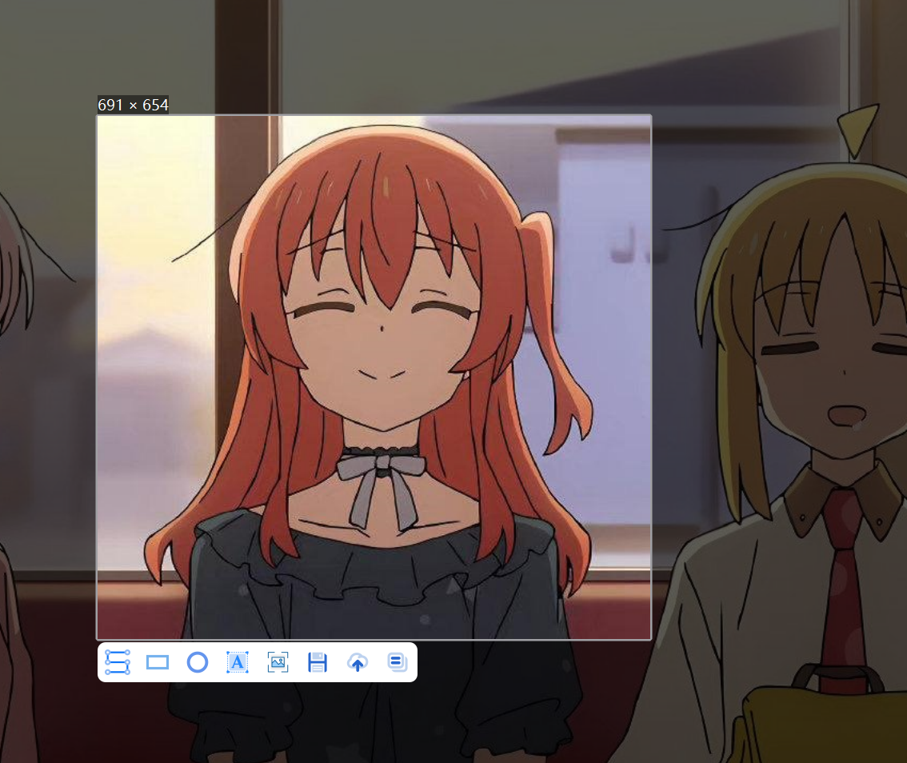
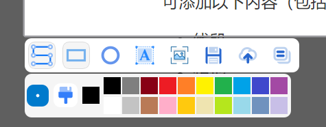
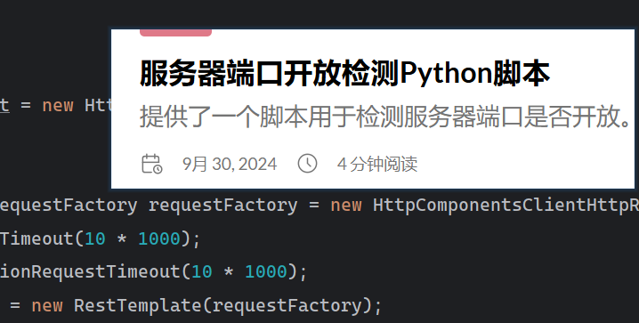
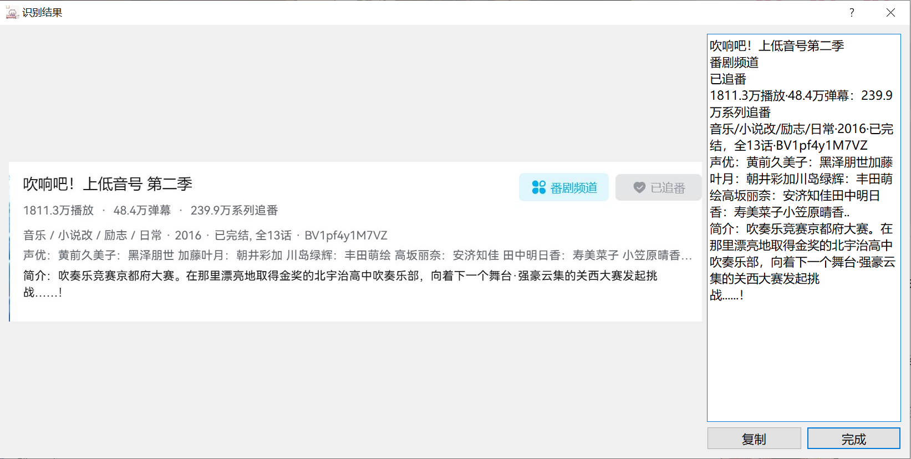

## Dian-Capture （点截）

点~~（巅）~~截，一款简单易用的截图软件，设计理念源自对用户体验的极致追求


### 功能特性

#### 基础截图



#### 图片基础修改

可添加以下内容（包括自定义颜色）：

- 线段
- 矩形
- 圆
- 文字



#### 图片 Pin

使用**鼠标中键**即可将图片钉住



#### OCR 识别\*

内置 OCR 识别接口，提供本地的文本识别服务



\*：OCR 功能为插件式实现，需运行项目中 Python 代码，详细配置指南请参考下文的 OCR 服务配置部分

#### PicGo 系列上传接口接入\*

集成了[PicGo](https://picgo.github.io/PicGo-Doc/)系列图片上传功能，可以直接上传截图并直接复制 url，同时支持 md 格式 url 快速复制（在设置中开启）

\*：此功能依赖于 PicGo，需先安装配置。请参见[PicGo 下载安装](https://picgo.github.io/PicGo-Doc/zh/guide/#下载安装)

#### 快捷键支持

提供了完整的快捷键支持，可见以下：

- F1：全局唤醒
- Enter：复制截图到剪切板
- S：保存截图
- P：绘制矩形
- L：绘制直线
- M：绘制椭圆
- T：添加文字
- O：OCR 识别
- U：截图上传
- ESC/鼠标右键：退出

#### 更多

- 兼容多显示器截图
- i18n 不完整支持
- 支持打开文件直接钉住
- more...

### OCR 服务运行指南

#### 环境需求

- Python 3.11（推荐版本，其他版本可能存在兼容性问题）
- Anaconda（可选，但推荐使用）

#### 安装方法

1. clone 代码

   ```bash
   git clone https://github.com/ZPolister/Capture-CPP
   ```

2. 新建并激活 Conda 虚拟环境（如不使用 Conda 可跳过此步）

   ```bash
   conda create -n ocr-service python=3.11
   conda activate ocr-service
   ```

3. 切换到 ocr 目录下，加载依赖

   ```bash
   cd Capture-CPP
   pip install -r requirements.txt
   ```

4. 运行项目

   ```bash
   python main.py
   ```

5. That's all.

### 开发环境

- C++11
- Qt 5.15
- MingW 8.1 / MSVC2017

### Thanks

- [Qt | 软件开发全周期的各阶段工具](https://www.qt.io/zh-cn/)
- [Molunerfinn/PicGo](https://github.com/Molunerfinn/PicGo)
- [RapidAI/RapidOCR](https://github.com/RapidAI/RapidOCR)
- **And You**

### ISSUE

反馈请直接提 issue 即可，欢迎 fork & mr。

~~看到这里的话，这只是个小课设，没什么含金量，浪费大家时间了（逃~~
